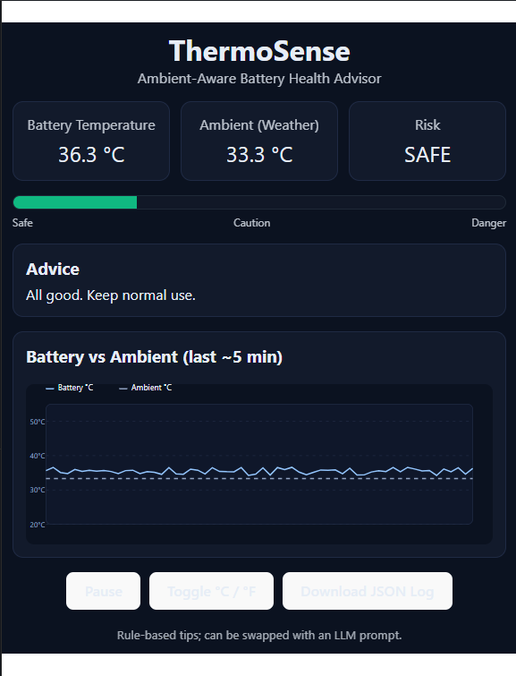
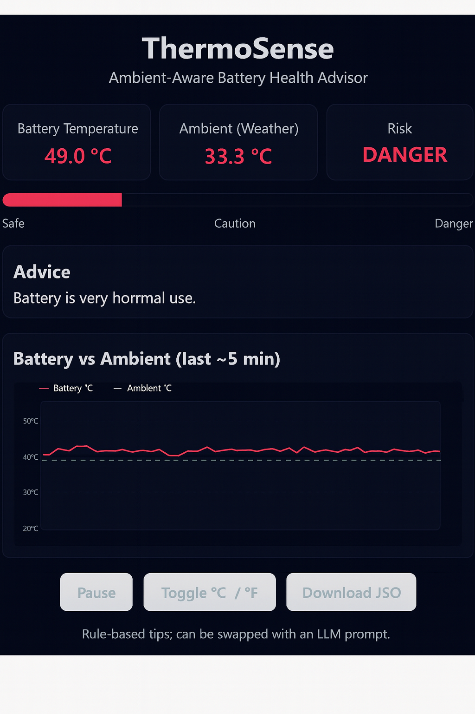
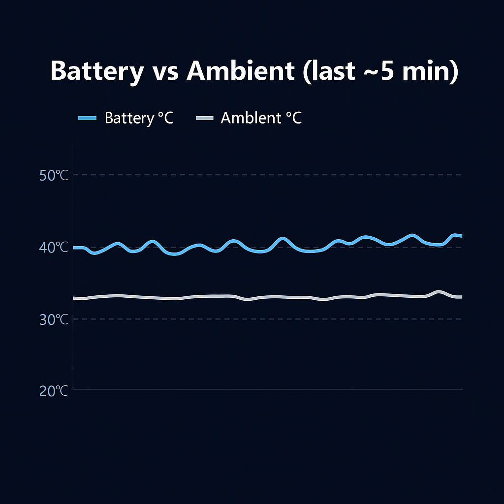

# 🌡️ ThermoSense – Ambient-Aware Battery Health Advisor

ThermoSense is my personal project built to **keep batteries healthier and safer** by monitoring temperature in real time, comparing it with the surrounding environment, and instantly giving actionable tips to the user.  

This project blends **live weather data**, **simulated battery monitoring**, and a **clean, interactive UI** — all running in the browser without any special hardware.

---

## ✨ What Makes It Special
- 📊 **Real-Time Monitoring** – Battery temperature updates every few seconds, just like a live dashboard.
- 🌍 **Ambient Weather Awareness** – Pulls actual weather temperature from your location to make smarter recommendations.
- 🚦 **Instant Risk Levels** – Always tells you if your battery is in **SAFE**, **CAUTION**, or **DANGER** zone.
- 💡 **Actionable Advice** – Gives practical steps to cool down or maintain healthy battery use.
- 📈 **Beautiful Live Chart** – Custom SVG line chart to compare battery and ambient temperatures over the last few minutes.
- 🎛 **Full Control** – Pause/resume monitoring, switch between °C and °F, and even download your battery log as a JSON file.

---

## 🛠 Built With
- **React + TypeScript** – For a smooth, component-based UI.
- **Vite** – For lightning-fast development and build.
- **Custom SVG Charts** – No bulky libraries, just pure control over the visuals.
- **Open-Meteo API** – To fetch live temperature data without requiring any API key.

---

## 📷 Demo Preview 
1. **Main Dashboard** – Current battery temp, ambient temp, and risk level.  
2. **Danger Mode** – Shows how the UI alerts when the battery is overheating.  
3. **Trend Chart** – See how temperature changes over time.  
4. **JSON Log Download** – Example of exported temperature history.

### Main Dashboard


### Danger Mode


### Trend Chart


### JSON Log Download


---

## 📦 How to Run Locally
```bash
# Clone the repository
git clone https://github.com/kimkookshi/Thermosense-project-MOTA.git
cd Thermosense-project-MOTA

# Install dependencies
npm install

# Start the development server
npm run dev
Now open http://localhost:5173 in your browser.

🧠 How It Works
Simulates Battery Temperature – Uses a heat/cooling model to mimic real-world battery behavior.

Reads Ambient Weather – Gets your local temperature using the Open-Meteo API.

Compares & Decides Risk Level – Uses a simple rule engine to determine if you’re safe or need action.

Displays Advice & Trends – Shows clear visual cues and a line chart to track changes.

🚀 Future Enhancements
Connect to real mobile battery sensors.

Use machine learning for predictive overheating alerts.

Create a PWA (Progressive Web App) for mobile users.

Add multi-day history and analytics.

🙋 About Me
I’m M Sree Ranjini, a tech enthusiast passionate about building practical, user-friendly solutions that combine data, design, and problem-solving. This project is part of my journey to sharpen my skills in modern frontend development and real-time data visualization.


